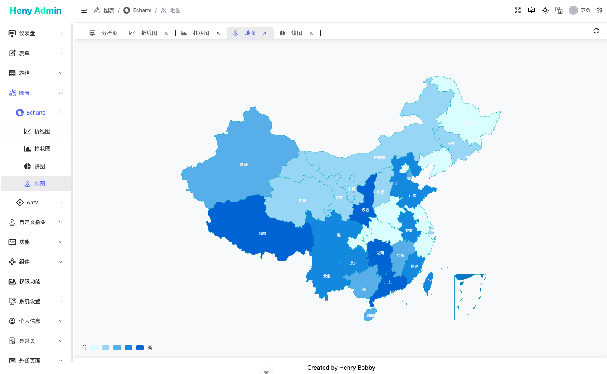

# vue-vite-admin

## 使用步骤

```bash
## Install（安装）
pnpm install

## Develop（开发）
pnpm dev

## Test（测试）
pnpm build:test

## Production（正式）
pnpm build

## Lint
pnpm lint:fix
pnpm lint:prettier
pnpm lint:style
```

## IDE Setup

- [VS Code](https://code.visualstudio.com/) + [Volar](https://marketplace.visualstudio.com/items?itemName=Vue.volar) (and disable Vetur) + [TypeScript Vue Plugin (Volar)](https://marketplace.visualstudio.com/items?itemName=Vue.vscode-typescript-vue-plugin).

## Preview

|  |  |
| :------------------------:  | :-------------------------: |
|  |  |
|  |  |
|  |  |
